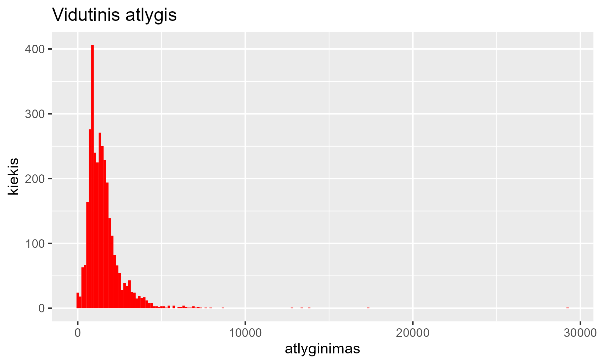
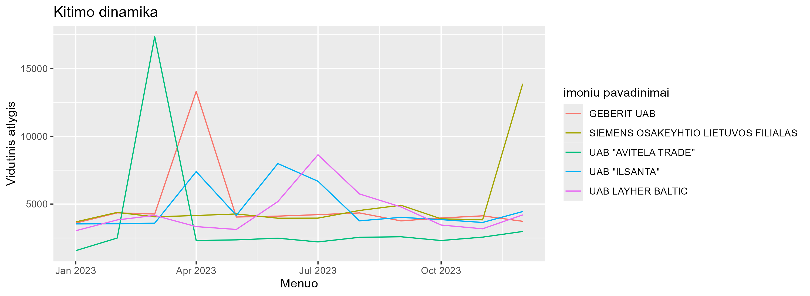
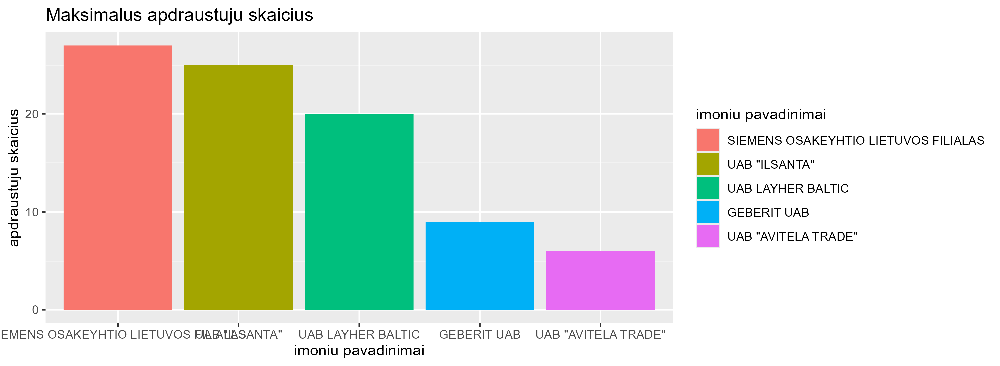
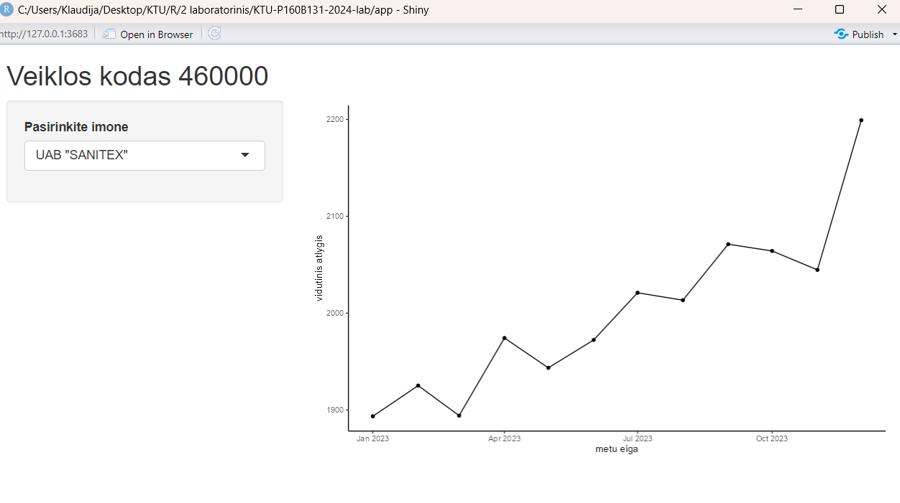

# R Laboratorinis darbas: duomenų vizualizacija

|Variantas | ecoActCode|Formatas          |
|:---------|----------:|:-----------------|
|18         |     460000|https://atvira.sodra.lt/imones/downloads/2023/monthly-2023.csv.zip|

### 2.1 Užduotis

Atsakymas:

Išvados: Iš vidutinio atlyginimo lentelės matome, kad didžiosios dalies žmonių atlyginimas svyruoja tarp 1000-3000 Eur.

### 2.2 Užduotis

Atsakymas:

Išvados: Iš atlyginimo kitimo dinamikos lentelės matome, kad UAB „Avitela Trade“ turėjo didžiausią vidutinio atlyginimo pakitimą kovo mėnesį. Tuo tarpu UAB „Ilsanta“ ir UAB „Layher Baltic“ išlaikė beveik tolygų vidutinį atlyginimą.

### 2.3 Užduotis

Atsakymas:

Išvados: Iš histogramos matome, kad didžiausias apdraustųjų skaičius yra UAB „Siemens Osakeyhtio Lietuvo filialas", mažiausias UAB „Avitela Trade".
### 3. Užduotis

Shiny R aplikacijos nuotrauka:

